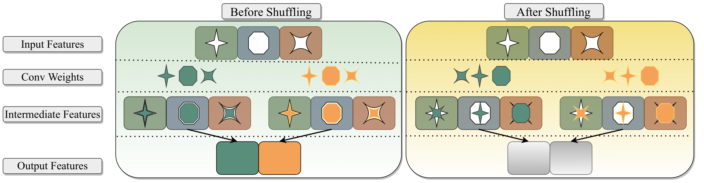

# Randomized Channel Shuffling: Minimal-Overhead Backdoor Attack Detection without Clean Datasets
[](https://opensource.org/licenses/MIT)

Codes for this paper **Randomized Channel Shuffling: Minimal-Overhead Backdoor Attack Detection without Clean Datasets** [NeurIPS 2022]

Ruisi Cai*, Zhenyu Zhang*, Tianlong Chen, Xiaohan Chen, Zhanyang Wang (* Equal contribution)

## Overview
Deep neural networks (DNNs) typically require massive data to train on, which is a hurdle for numerous practical domains. Facing the data shortfall, one viable option is to acquire domains-specific training data from external uncensored sources, such as the open web or the third-party data collectors. However, the quality of such acquired data is often not rigorously scrutinized, and one cannot easily rule out the risk of "poisoned" examples being included in such unreliable datasets, resulting in unreliable models which pose potential risks to many data-hungry, or high-stake applications. While existing methods usually suffer from high computational cost and unrealistic assumption on the access of clean data, this paper achieve to detect backdoors for victim models with limited prior knowledge: in particular, for one unreliable model, users (1) have no prior knowledge whether it is poisoned, or on the target class/percentage of poisoned samples, and (2) have no access to a clean sample set from *the same domain distribution*, nor any trusted model trained on such clean data. 
We investigate the contrasting channel-level statistics between backdoor trigger and clean features, and consequently, how the former can be differentiated by progressive channel shuffling.
Based on it, we propose the randomized channel shuffling method for backdoor-targeted class detection, which requires only a few feedforward passes and thus incurs minimal overheads, and demands no clean sample nor prior knowledge, while the identified target class help accelerate trigger recovery by highlighting the classes of interest.
Extensive experiments are conducted with three datasets (CIFAR-10,  GTSRB, Tiny ImageNet), three architectures (AlexNet, ResNet-20, SENet-18), and three attacks (BadNets, clean label attack, and WaNet). Results consistently endorse the effectiveness of our technique in backdoor model detection,  with margins of 0.291～0.640 AUROC over the current state-of-the-art methods. 



## Requirements

Requires PyTorch 1.8.2+, torchvision, advertorch, numpy, pandas, sklearn, matplotlib, scipy.
GTSRB dataset can be downloaded from https://benchmark.ini.rub.de/.


## Usage

### Train Models

Train benign models.
```
python train.py --rate 0 --seed <seed> --data <data_path> --checkpoint_root <model_save_path>
```

Train backdoor models attacked by BadNets.
```
python train.py --atk patch --rate 0.1 --seed <seed> --data <data_path> --checkpoint_root <model_save_path>
```

Train backdoor models attacked by CLA.
```
python train.py --atk cla --rate 1 --seed <seed> --data <data_path> --checkpoint_root <model_save_path> --robust_model <robust_model_path>
```

Train backdoor models attacked by WaNet.
```
python train.py --atk wanet --model PreActResNet18 --rate 0.1 --lr 0.01 --seed <seed> --data <data_path> --checkpoint_root <model_save_path> 
```

### Backdoor Detection
Detect backdoor models attacked by BadNets.
```
cd detection/curve
python main.py --rate 0 --data_num 1024 --last --N_model <N_models> --checkpoint_root <benign_model_save_path> --save_path <benign_save_path> --data <data_path>
python main.py --atk patch --data_num 1024 --last --N_model <N_models> --checkpoint_root <backdoor_model_save_path> --save_path <backdoor_save_path> --data <data_path>
python analysis.py --N_model <N_models> --benign_path <benign_save_path> --trojan_path <backdoor_save_path>
```

Detect backdoor models attacked by CLA.
```
cd detection/curve
python main.py --rate 0 --data_num 1024 --last --N_model <N_models> --checkpoint_root <benign_model_save_path> --save_path <benign_save_path> --data <data_path>
python main.py --atk cla --rate 1 --data_num 1024 --last --N_model <N_models> --robust_model <robust_model_path> --checkpoint_root <backdoor_model_save_path> --save_path <backdoor_save_path> --data <data_path>
python analysis.py --N_model <N_models> --benign_path <benign_save_path> --trojan_path <backdoor_save_path>
```

Detect backdoor models attacked by WaNet
```
cd detection/curve
python main.py  --rate 0 --model PreActResNet18 --data_num 1024 --last --N_model <N_models> --checkpoint_root <benign_model_save_path> --save_path <benign_save_path> --data <data_path>
python main.py --atk wanet --k 6 --s 0.8 --model PreActResNet18 --data_num 1024 --last --N_model <N_models> --checkpoint_root <backdoor_model_save_path> --save_path <backdoor_save_path> --data <data_path>
python analysis.py --N_model <N_models> --benign_path <benign_save_path> --trojan_path <backdoor_save_path>
```


## Pretrained model
We provide a clean model and a attacked model (by BadNets) on CIFAR-10, ResNet-20 in `pretrained`. More models will coming soon...

## Citation
TBD